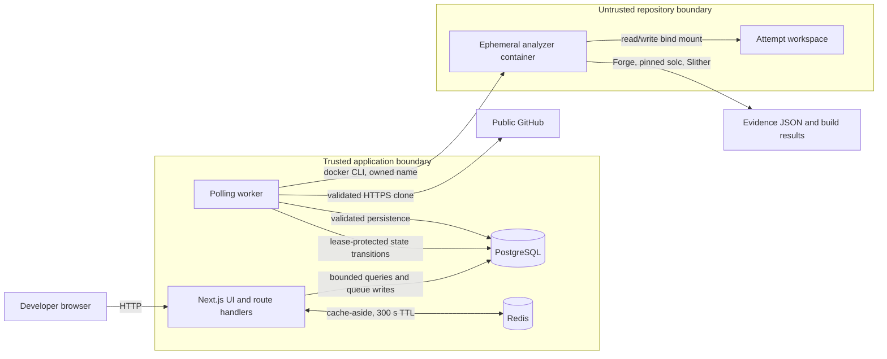
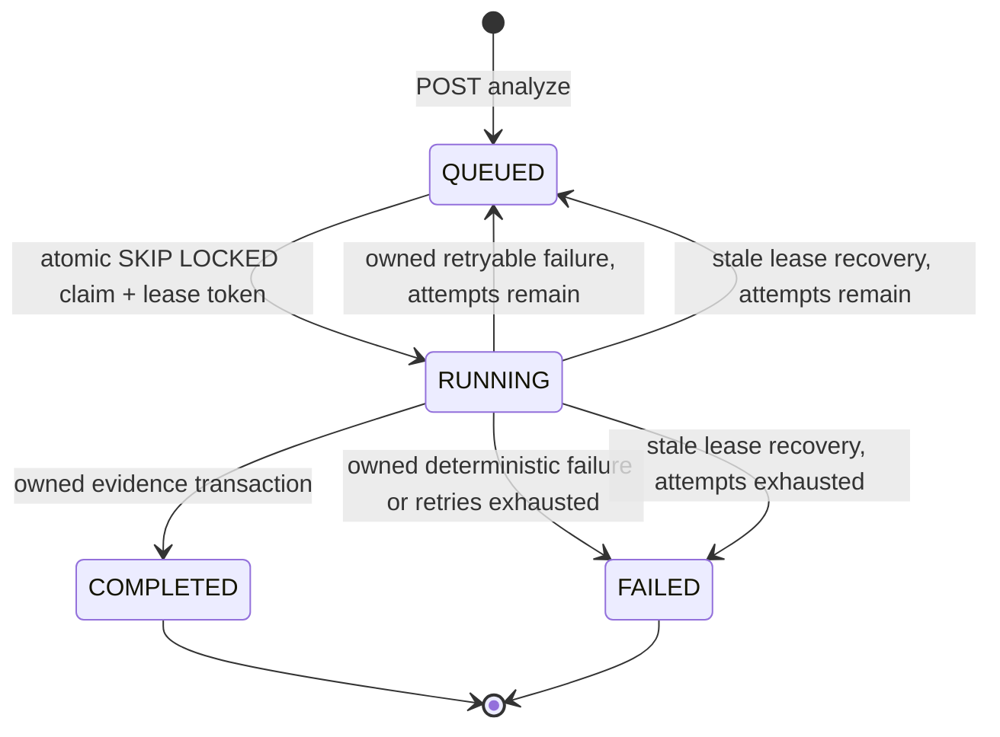
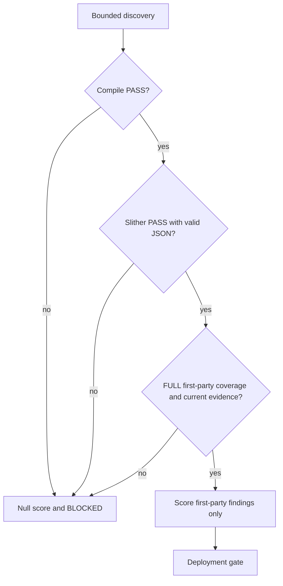

# ChainGuard MVP architecture

## System context and trust boundaries

The browser and repository are untrusted. Route handlers validate and bound inputs. The worker is trusted orchestration code, but repository contents are data only on the host. Compilation, tests, and Slither run inside an ephemeral analyzer container. PostgreSQL is the durable evidence authority; Redis only caches validated compact responses.

## Analysis lifecycle

Only one queued/running analysis is allowed per project. Each claim increments `attemptCount`, records an opaque `executionToken`, and derives a unique workspace and container name from that lease. Every result write includes analysis ID, RUNNING status, and token. Stale recovery first atomically invalidates that exact lease, then removes only its resources. This prevents an old worker from overwriting or cleaning up a fresh retry.

## Analyzer isolation

Repository URLs must be exact public GitHub HTTPS repository URLs. Clone and submodule processes use argument arrays, bounded output, timeouts, and a 512 MiB/50,000-entry owned-workspace limit. Submodules are limited in count and URL namespace; traversal, absolute, credentialed, file, SSH, final-symlink, and ancestor-symlink paths are rejected.

Analyzer containers preserve these controls:

- `--network none`
- read-only container root
- all Linux capabilities dropped
- `no-new-privileges`
- non-root host UID/GID
- 2 GiB memory, 2 CPU, and 512 PID limits
- bounded tmpfs and bounded host workspace
- no Docker socket, host network, privileged mode, or runtime compiler downloads

The image contains Forge, Slither, and approved solc versions. Forge receives the selected compiler explicitly. Slither receives both `--solc` and `FOUNDRY_SOLC`, so Crytic/Forge uses the same pinned compiler without network access.

## Evidence and score model

A score exists only for current evidence with compilation PASS, Slither PASS, and FULL coverage. Unsupported compilers, missing/malformed output, no contracts, rejected first-party sources, unanalysed roots, and legacy rows are null-score/BLOCKED. Gate reasons describe the missing prerequisite; a null score never receives `SCORE_BELOW_THRESHOLD`.

Slither paths are normalized relative paths. First-party attribution requires membership in the selected-root source inventory. Valid `lib`/`node_modules` and generated/build path segments remain deterministically dependency/generated even when a depth budget omitted them. Absolute paths, traversal, and unproven source paths are UNKNOWN and never affect the first-party score. A mixed detector remains first-party when at least one proven first-party element is involved.

Legacy database rows remain accessible, but API and UI presentation nulls historic score, compilation, test, count, and finding evidence and labels the record “Legacy analysis — rerun required.”

## Deployment guidance and limits

This repository is a local/internal MVP, not a public production service. A production design must add authentication and authorization, private-repository credential isolation, rate limits, audit logging, secret management, TLS, backups, monitoring, and a dedicated worker runtime. Never mount a Docker socket into the web application. If the worker controls a Docker daemon, isolate it on a dedicated host or constrained service account and treat daemon access as privileged infrastructure authority.

Current deliberate limitations are Foundry-focused execution, solc 0.8.20/0.8.24 only, one selected Foundry root, public GitHub repositories only, no Hardhat/Truffle execution, and no deployment action. Dependency-only findings are visible but do not change the default project score.
